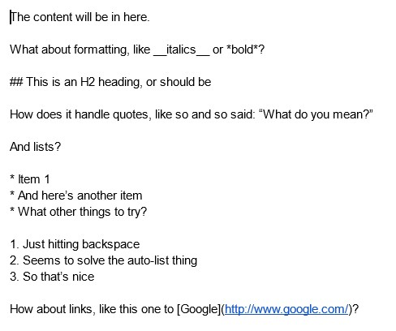
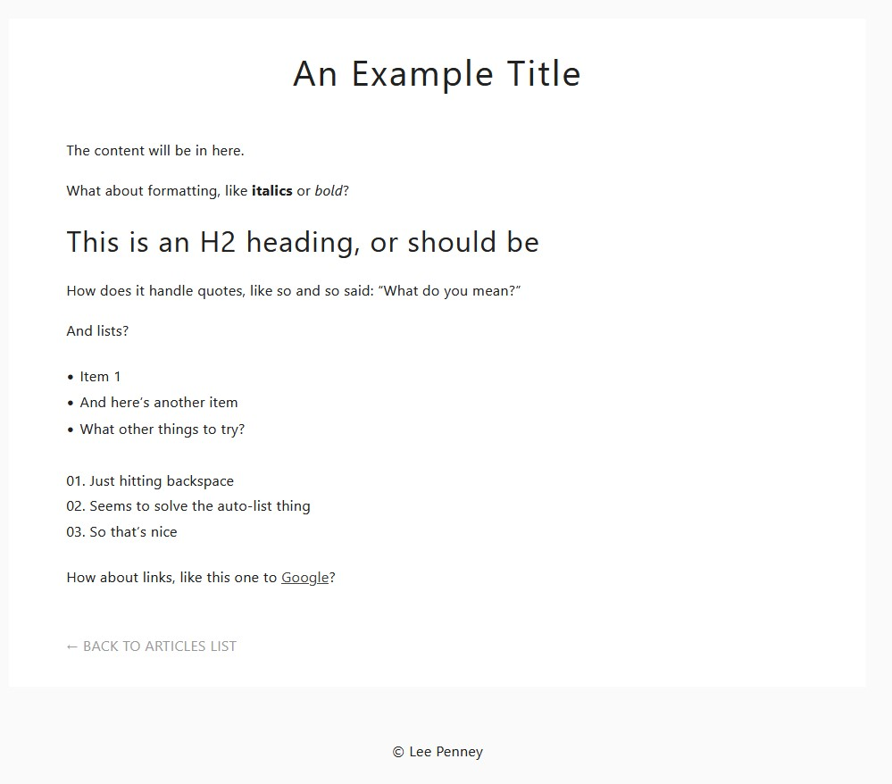

# Using Google Docs as a Simple CMS
While running my Shave Country website, I was looking to add some articles to help with SEO. As the site was static other than that I didn't want to add a CMS and instead looked for a way to add the articles with minimal fuss.

Inspired by the [Blot.im](https://blot.im/) was using with Dropbox and what the [NY Times was doing](https://awards.journalists.org/entries/archieml/) using Google Docs and [ArchieML](http://archieml.org/) I decided to see if I could whip up something using a similar approach.

## Requirements

* A server running PHP
* A Google account with Google Docs
 * A draft folder
 * A published folder
* A Zapier account
 * Two Zaps:
  1. To monitor the drafts folder
  2. To monitor the published folder
* A Sparkpost account

## Features

* Turns Google Docs using Markdown into HTML files via templates
* Generats an index of the articles you publish
* Allows for preview versions of content (which create the file but don't update the index)
* Sends email notifications when previews are created or articles published

## How it works

Zapier monitors a pair of folders in a Google Docs account (a draft folder and published one) and when a new file appears it posts the contents of that doc to the PHP file, which takes the supplied text and title, runs it through a Markdown formatter, then through some Twig templates, and then saves the file as index.html inside a URL safe folder created from the document's name.

### Example input

### Example output

## Configuration

1. Update the templates in the template folder as required
2. Update the CSS file in the css folder as reuired
3. Add images in the img folder as required
4. Update the settings in the api.php file
5. Upload all of the folders and the api.php file to a publicly accessible server running PHP
6. Create two folders in a Google Docs account:
    1. a drafts folder (to create drafts without adding to the index page)
    2. a published folder (where docs for articles that are published will reside)
7. Create two Zaps, one for each folder, which:
    1. Monitor the designated folder in Google drive
    2. Post to the URL where the api.php can be found (i.e. https://your.domain/api.php)
    3. Pass the follow data as JSON:
        * status (either draft or )
        * title (the Title from the Google Doc)
        * contents_txt (the File Txt from the Google Doc)
        * auth_code (the random string you added to the settings in the api.php file)
    4. Do no wrape the request in an Array
    5. Do say Yes to the unflatten option

## Technologies used

* PHP
* Twig (for templates)
* Sparkpost (to send email notifications)
* Zapier (to watch the folders in Google Docs)
